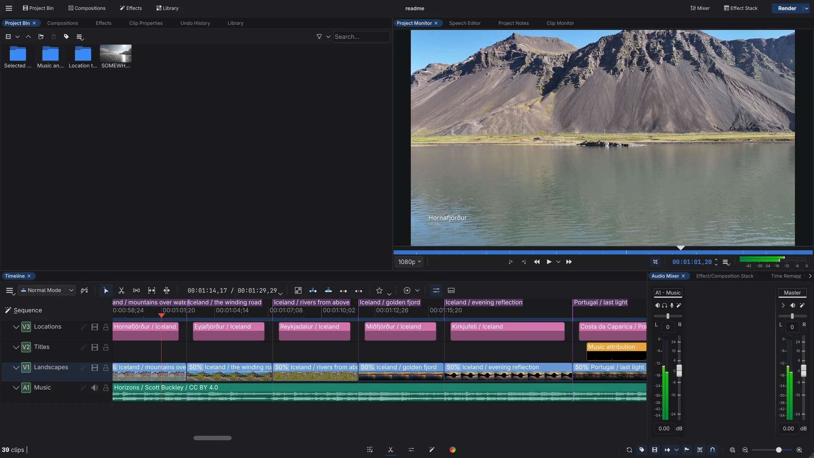
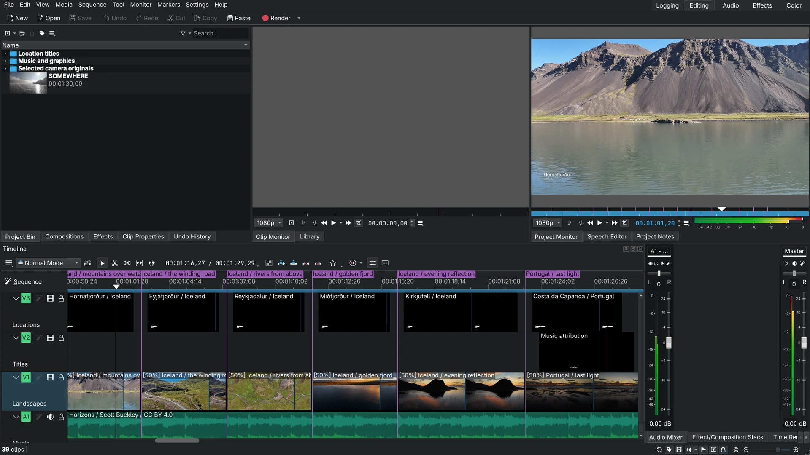
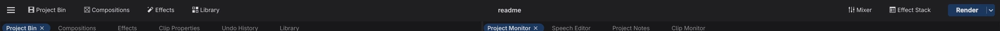
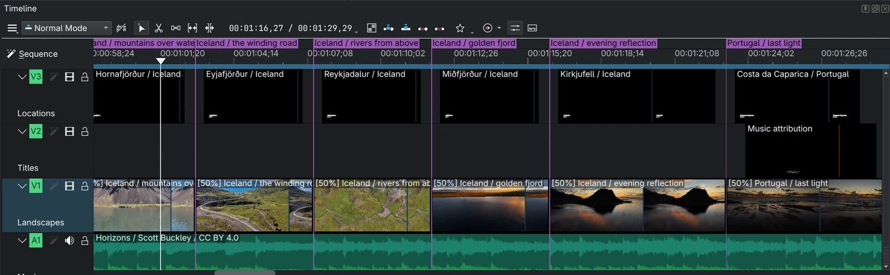
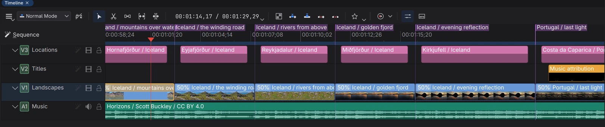
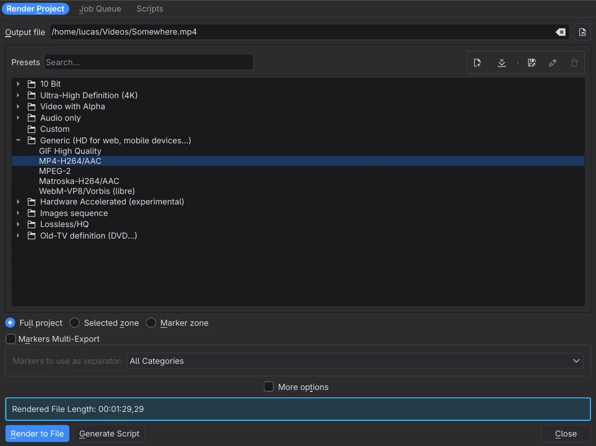

# Kdenlive Live

**An experimental community fork of [Kdenlive](https://kdenlive.org), built on its development branch, exploring two ideas: editing alongside an AI agent inside the running editor, and a calmer, denser interface that puts the footage first.**

It is not an official KDE release. Every change is kept on its own branch so it can be discussed, reviewed and, where it makes sense, proposed upstream.



## Philosophy

- **Footage first.** The interface is neutral graphite with a single blue accent, so the most colorful thing on screen is your video. Chrome gets quieter and smaller; content gets the space.
- **Dense, not cluttered.** Professional editors spend hours in their tools. Compact lanes, one top bar and one viewer show more of the edit without adding noise, in the spirit of DaVinci Resolve and Final Cut Pro.
- **Your settings win.** Only defaults change. An existing color scheme, layout, menu bar or track height is kept, and everything new can be switched back.
- **The agent edits like you do.** AI edits go through the same model, revisions and shared Undo as your own, from the editor itself, with no companion server. You can watch every change happen and undo it.
- **Safe by default.** The editing API is off until you enable it, listens on localhost only, rejects web pages, and can require a token.
- **Upstream friendly.** Each feature is a self contained branch with a pull request against KDE's `master`, built so it can be split and proposed to the Kdenlive team.

## Before and after

| Kdenlive 26.08 (stock) | Kdenlive Live |
| --- | --- |
|  |  |

## A modern editing interface

### One frame, one viewer



- **Panel top bar** in place of the menu bar: a menu button, panel toggles (Project Bin, Compositions, Effects, Library on the left; Mixer and Effect Stack on the right), the project name centered with an *Edited* state, and the Render button. The classic menu bar is one Ctrl+M away.
- **Page bar** at the bottom: the workspaces (Logging, Editing, Audio, Effects, Color) become icons, with an accent underline on the current page.

  
- **Single viewer** Editing layout: the project bin on the left and one large viewer, with the clip monitor as a tab behind it.
- **Pill tabs** for every panel, even single ones, with close buttons on the current and hovered tab, flat scroll arrows and line icons in title bars.
- Centered transport controls, a near-black monitor surround and a hint in the empty clip monitor.

### Lanes that show more of the edit

| Before | After |
| --- | --- |
|  |  |

- **Clips are self contained blocks**: rounded, outlined, with a name strip in the clip type color (blue video, pink titles, green audio, or the clip's tag color).
- **Compact lanes** separated by a small gap, about half the previous default height, with the track name on the same row as its controls.
- A **continuous filmstrip** instead of first and last frames, **waveforms tinted** from their clip color, and titles shown as solid blocks.
- A red playhead, a quieter ruler with a translucent zone, tinted guide chips and a speed badge instead of a `[50%]` prefix.

### Controls and dialogs



- **Kdenlive Dark** color scheme, neutral graphite with semantic colors tuned for the timeline.
- **KdenliveStyle**, a widget style layered on Qt's Fusion fallback: a 4px spacing scale, flat rounded buttons, inputs and combo boxes, accent check boxes and radio buttons, slim scroll bars and chevron arrows. Dialogs get a raised surface, and only their primary action (like *Render to File*) is filled with the accent.
- The style applies when Qt falls back to Fusion, which is common outside Plasma. Desktops with Breeze keep their own controls.

## Live editing with MCP

Kdenlive Live serves the [Model Context Protocol](https://modelcontextprotocol.io) directly from the editor over HTTP, so assistants like Claude, Cursor or Codex can edit the project you have open.

- Enable it in **Settings → Configure Kdenlive → MCP API** and copy a ready made client configuration (JSON, a `claude mcp add` command, a Codex entry or the bare URL).
- Tools cover the whole edit: reading state, importing and replacing media, inserting, moving and trimming clips, audio fades and gain, effects, titles, reframing for vertical video, changing the frame size, capturing a frame as an image, rendering, and batches of up to 200 edits as one Undo step.
- Every edit is checked against the project revision and shares the editor's native Undo history, so manual and agent edits interleave safely.

See the [native MCP guide](docs/native-mcp.md) for setup, security and the full tool list. A [legacy D-Bus bridge](docs/live-bridge.md) is also available as a build option.

## Branches

| Branch | Pull request | Contents |
| --- | --- | --- |
| `feat/mcp-live-bridge` | [#1](https://github.com/lucasscariot/kdenlive/pull/1) | Native MCP server with live editing, shared Undo and access control |
| `feat/mcp-vertical-reframe` | [#2](https://github.com/lucasscariot/kdenlive/pull/2) | Reframing, effects, titles, frame capture and rendering tools (builds on #1) |
| `feat/ui-polish` | | The interface work described above, independent of the MCP branches |
| `main` | | KDE `master` with every feature branch merged: the branch to build and try |

`kde-master` mirrors KDE's `master` and is the base of every pull request.

## Build and try

Build `main` with the usual [Kdenlive dependencies](dev-docs/build.md). The MCP API also needs Qt 6.11 or newer **HttpServer** and **WebSockets**; the interface work needs nothing extra.

```bash
git clone -b main https://github.com/lucasscariot/kdenlive.git kdenlive-live
cd kdenlive-live
cmake -S . -B build -G Ninja \
  -DCMAKE_BUILD_TYPE=Release -DBUILD_TESTING=OFF \
  -DKDENLIVE_MCP_API=ON -DKDE_INSTALL_USE_QT_SYS_PATHS=OFF \
  -DCMAKE_INSTALL_PREFIX="$PWD/install"
cmake --build build
cmake --install build
bash packaging/live-mcp/install-user.sh "$PWD/install"
```

The installer puts a private copy in `~/.local/opt/kdenlive-live` with a **Kdenlive Live MCP** launcher and its own settings, so it runs next to a system Kdenlive without touching it. Leave out `-DKDENLIVE_MCP_API=ON` to build only the interface changes.

## Get involved

This fork is a proposal as much as a product. The most useful help right now:

- **Try it on real projects** and report what breaks or slows you down, especially with long timelines and on desktops other than Plasma.
- **Design feedback**: screenshots of what feels wrong are as valuable as code.
- **Agent workflows**: share what you build with the MCP tools and which tools are missing.
- **Upstreaming**: help shape the branches into changes the Kdenlive team can accept, and join the discussion on [KDE Invent](https://invent.kde.org/multimedia/kdenlive) and `#kdenlive-dev:kde.org`.

Open an issue or a pull request against the matching branch on this repository.

---

## About Kdenlive

Kdenlive is a powerful, free and open-source video editor that brings professional-grade video editing capabilities to everyone. Whether you're creating a simple family video or working on a complex project, Kdenlive provides the tools you need to bring your vision to life.

For more information about Kdenlive's features, tutorials, and community, please visit our [official website](https://kdenlive.org).

There you can also find downloads for both stable releases and experimental daily builds for Kdenlive.

## Contributing to Kdenlive

Kdenlive is a community-driven project, and we welcome contributions from everyone! There are many ways to contribute beyond coding:

- Help translate Kdenlive into your language
- Report and triage bugs
- Write documentation
- Create tutorials
- Help other users on forums and bug trackers

Visit [kdenlive.org](https://kdenlive.org) to learn more about non-code contributions.

## Developer Information

### Technology Stack

Kdenlive is written in C++ and is using these technologies and frameworks:

- **Core Framework**: MLT for video editing functionality
- **GUI Framework**: Qt and KDE Frameworks 6
- **Additional Libraries**: frei0r (video effects), LADSPA (audio effects)

### Getting Started

1. Check out our [build instructions](dev-docs/build.md) to set up your development environment
2. Familiarize yourself with the [architecture](dev-docs/architecture.md) and [coding guidelines](dev-docs/coding.md)
4. If the MLT library is new to you check out [MLT Introduction](dev-docs/mlt-intro.md)
3. Join our Matrix channel `#kdenlive-dev:kde.org` for developer discussions and support

### Contributing Code

Kdenlive's primary development happens on [KDE Invent](https://invent.kde.org/multimedia/kdenlive). While we maintain a GitHub mirror, all code contributions should be submitted through KDE's GitLab instance. For more information about KDE's development infrastructure, visit the [KDE GitLab documentation](https://community.kde.org/Infrastructure/GitLab).

### Finding Things to Work On

- Browse open issues on [KDE Invent](https://invent.kde.org/multimedia/kdenlive/-/issues), for example those labeled with [First Task](https://invent.kde.org/multimedia/kdenlive/-/issues?label_name%5B%5D=First%20Task)
- Check the [KDE Bug Tracker](https://bugs.kde.org) for reported issues
- Look for issues tagged with "good first issue" or "help wanted"

Need help getting started? Join our Matrix channel `#kdenlive-dev:kde.org` - our community is friendly and always ready to help new contributors!

Please get in touch with us before working on a task, either by commenting in the issue or through our Matrix channel.
